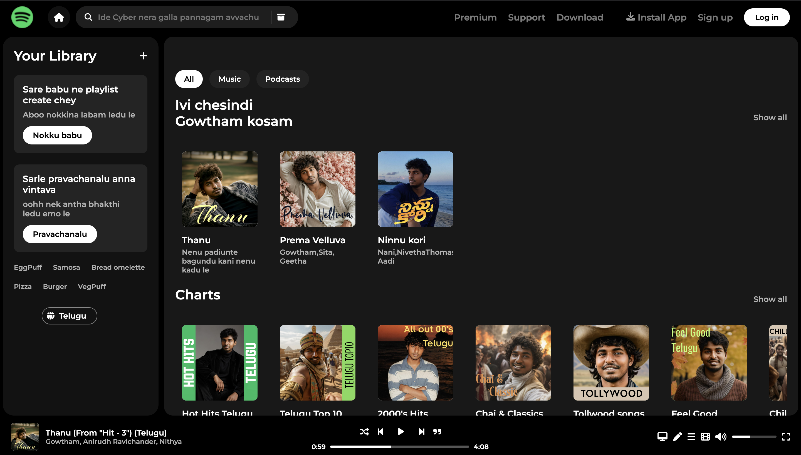

# 🎵 Spotify Clone – Made with HTML & CSS (JavaScript Coming Soon!)

Welcome to **Spotify Clone**, a pixel-perfect recreation of Spotify’s iconic interface – built with just **HTML** and **CSS** (for now!). This is a passion project where design meets precision, and it's just the beginning. JavaScript magic is on the way!

---

## 🎬 Live Demo

> 🔗 [View the Live Project](https://spotify-iota-orcin.vercel.app/)

---

## 🖼️ Preview

  

---

## 🎯 Goal

To **recreate Spotify’s UI** with pure HTML & CSS first – no shortcuts, no frameworks. Every spacing, font, and interaction has been hand-crafted to match the real experience.

Coming up: full **JavaScript integration** for a working music player, interactions, and dynamic content.

---

## 🔥 Features (So Far)

- 🎤 **Popular Artists Carousel** – Styled like Spotify with circular images and hover play buttons
- 💿 **Albums & Singles Section** – Responsive album grid with real song/artist info
- 🎚️ **Custom Music Player UI** – Styled progress bar, icons, and song details
- 🎵 **Spotify-Like Font + Color Scheme** – Clean, modern, and familiar
- 📱 **Fully Responsive** – Works on mobile, tablet, and desktop
- 🧼 **No Frameworks** – Just HTML & CSS

---

## 🛠️ Built With

- **HTML5** – Structure & semantics  
- **CSS3** – Styling, layout, animations  
- **Google Fonts** – Matching Spotify’s typography  
- **Flexbox + Grid** – For responsive layout

---

## 📦 Planned (Coming Soon in JavaScript)

- ✅ Interactive Play/Pause Button  
- ✅ Functional Progress Bar  
- ✅ Song Playback & Track Switching  
- ✅ Scrollable Sections  
- ✅ Light/Dark Mode  
- ✅ Backend Music Support (maybe Firebase or Node.js)

---

## 📌 Notes

- This clone is **UI-only** for now – all data and music are static.
- Perfect for learning **HTML/CSS layout**, **Spotify’s design system**, and how to plan **JavaScript integration** step-by-step.

---

## 🧑‍💻 Author

Made with ❤️ by **[Gowtham]**   
📸 [Instagram](https://instagram.com/gowthmrdyy/)  
💼 [LinkedIn](https://linkedin.com/in/gowthamrdyy)

---

## 📄 License

This project is for **educational and portfolio use only**.  
Spotify™ and all related trademarks are owned by **Spotify AB**.

---

>“Music gives a soul to the universe, wings to the mind, flight to the imagination.” – Gowtham sree charan Reddy.

